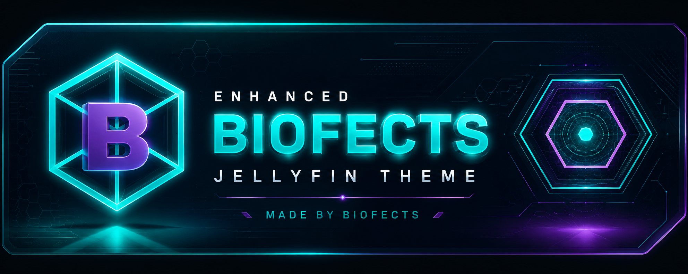
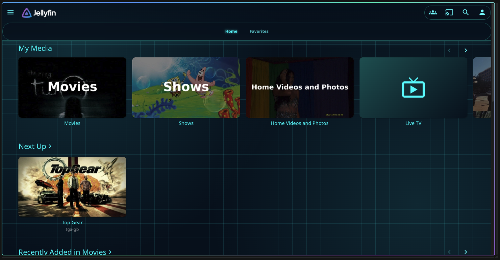
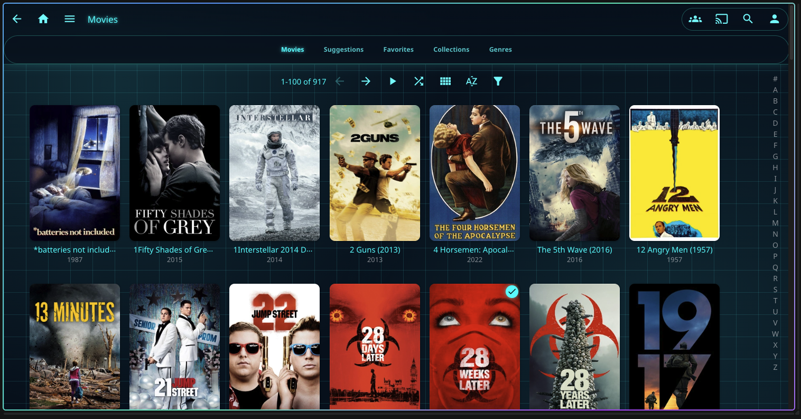
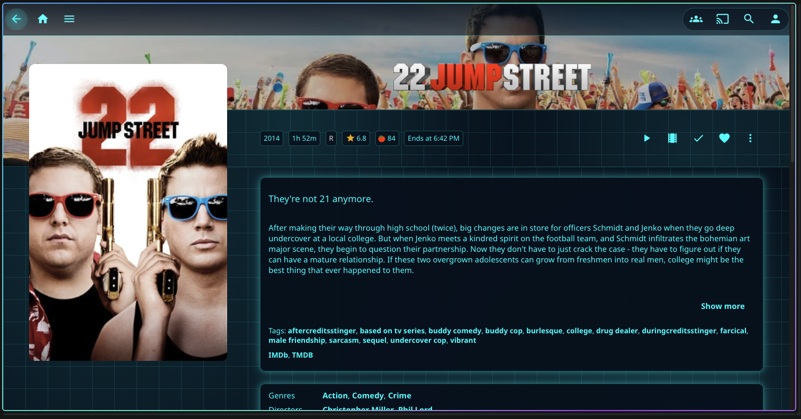

   

   
   
   

# Enhanced Biofects - Jellyfin Theme

A dark, neon-cyan, sci-fi theme for Jellyfin's web UI, adapted from the
color palette and glow aesthetic of the [Enhanced-Biofects](https://github.com/biofects/Enhanced-Biofects)
Home Assistant theme (deep navy backgrounds, bright turquoise `#00FFFF`
accents, glowing card borders, and a faint circuit-grid backdrop).

This is a plain CSS file. Jellyfin doesn't use Home Assistant-style YAML
themes, so the original theme's colors and effects have been reinterpreted
as CSS targeting Jellyfin's web client elements (header, sidebar, cards,
buttons, dialogs, player OSD, login page, etc).

## Screenshots

### Home

### Movies

### Details

## Install (server-wide, recommended)

1. Sign in as an administrator and open **Dashboard**.
2. Go to **General** (or **Branding**, on Jellyfin 10.11+).
3. Scroll to **Custom CSS code**.
4. Paste the entire contents of `Enhanced-Biofects-Jellyfin.css` into the box.
5. Click **Save**. Reload the page.

## Install (single user only)

1. Open **Settings** (your user icon, top right).
2. Go to **Display**.
3. Scroll to **Custom CSS code** and paste the file contents.
4. Click **Save**.

## Making it an "official" Skin Manager theme

The actively maintained theme manager for modern Jellyfin (10.10/10.11+) is
[Jellyfin-PG/Skin-Manager](https://github.com/Jellyfin-PG/Skin-Manager). It
reads its theme store live from a JSON catalog at
[Jellyfin-PG/Skin-Manager-Themes](https://github.com/Jellyfin-PG/Skin-Manager-Themes) —
getting an entry added there is what makes a theme show up, searchable, in
everyone's Skin Manager store with no extra steps for the end user.

**Their requirements, verbatim:**
- CSS hosted at a stable, public URL — **jsDelivr is strongly preferred**
  (works automatically for any public GitHub repo, no setup needed)
- Tested against Jellyfin 10.10 or 10.11
- Source publicly available (a GitHub repo, basically)

**Steps to submit:**

1. **Create a public GitHub repo** for the theme, e.g.
   `biofects/Enhanced-Biofects-Jellyfin-Theme`, and push `Enhanced-Biofects-Jellyfin.css`
   to it (root of the `main` branch is simplest).
2. Your CSS is then automatically servable via jsDelivr at:
   `https://cdn.jsdelivr.net/gh/<user>/<repo>@main/Enhanced-Biofects-Jellyfin.css`
   (jsDelivr mirrors any public GitHub repo — nothing to configure).
3. **Take a screenshot** of the theme running against a real library (the
   home screen and a details page look best) and add it to the repository,
   then use its raw GitHub URL as `previewUrl`.
4. Open an issue on
   [Skin-Manager-Themes](https://github.com/Jellyfin-PG/Skin-Manager-Themes/issues/new/choose)
   using the **"Theme Submission"** template. Use `skins-json-entry.json`
   (included alongside this README) as the entry — just swap in your real
   repo URLs once step 1–3 are done. A maintainer reviews and merges it
   into `skins.json`; once merged, it appears in everyone's Skin Manager
   store automatically, no plugin update required.
5. When you update the CSS later, bump `"version"` in your submission (or
   a follow-up PR/issue to the catalog) — Skin Manager auto-detects the
   bump and refreshes the stylesheet for everyone using it.

The theme already exposes one configurable variable, **Accent Color**
(`--accent-color`, defaults to `#00ffff`), which Skin Manager will surface
as a color picker in its settings UI once the theme is selected — so
users can retint the whole glow effect without touching CSS.

## Support and Contributing

- [Report a theme bug](https://github.com/biofects/Enhanced-Biofects-Jellyfin-Theme/issues/new?template=bug_report.yml)
- [Request a feature](https://github.com/biofects/Enhanced-Biofects-Jellyfin-Theme/issues/new?template=feature_request.yml)
- Read the [contribution guide](CONTRIBUTING.md) before opening a pull request.
- Follow the [Code of Conduct](CODE_OF_CONDUCT.md) in all project spaces.

Suspected vulnerabilities must not be posted publicly. Follow the private
reporting process in the [Security Policy](SECURITY.md).

For Jellyfin installation, playback, or server support unrelated to this
theme, use the [official Jellyfin support channels](https://jellyfin.org/contact/).

## Support the Project

Development is supported through [GitHub Sponsors](https://github.com/sponsors/biofects)
or [PayPal](https://www.paypal.com/cgi-bin/webscr?cmd=_s-xclick&hosted_button_id=TWRQVYJWC77E6).

## License and Disclaimer

Enhanced Biofects is available under the [MIT License](LICENSE).

This is an independent community theme and is not affiliated with, endorsed
by, or maintained by the Jellyfin project. Jellyfin and its marks belong to
their respective owners. No Jellyfin artwork is included in the theme logo.

## Notes

- If you also use another server-wide custom theme, the two will conflict —
  use only one at a time, or merge them manually.
- Tested against selectors from the current Jellyfin web client (10.11.x).
  If Jellyfin renames a class in a future release, a rule or two may stop
  matching — nothing will break, it'll just fall back to the default look
  for that element.
- Want the circuit-grid background more/less subtle, or a different accent
  color? Everything is driven by the CSS variables at the top of the file
  (`--eb-accent`, `--eb-bg-navy`, etc.) — change those and the whole theme
  follows.
